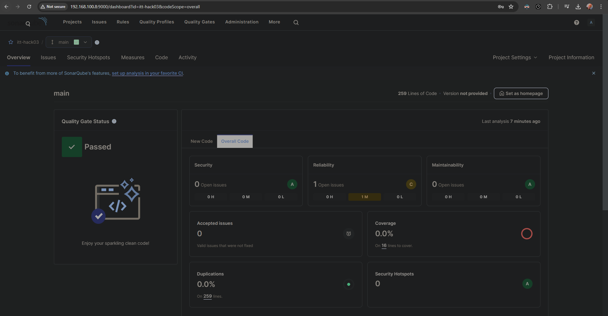
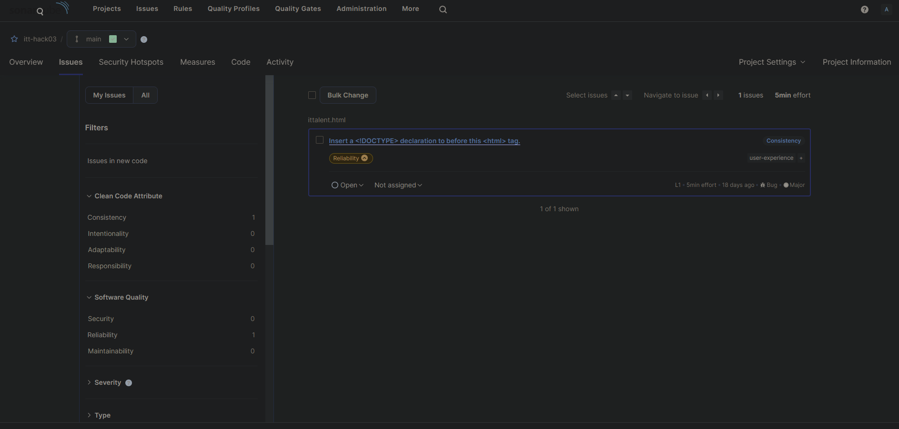
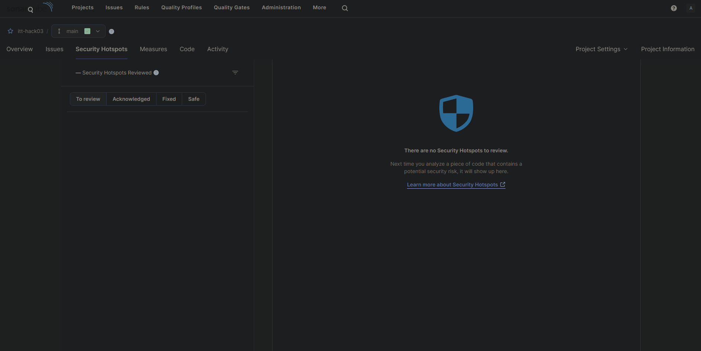
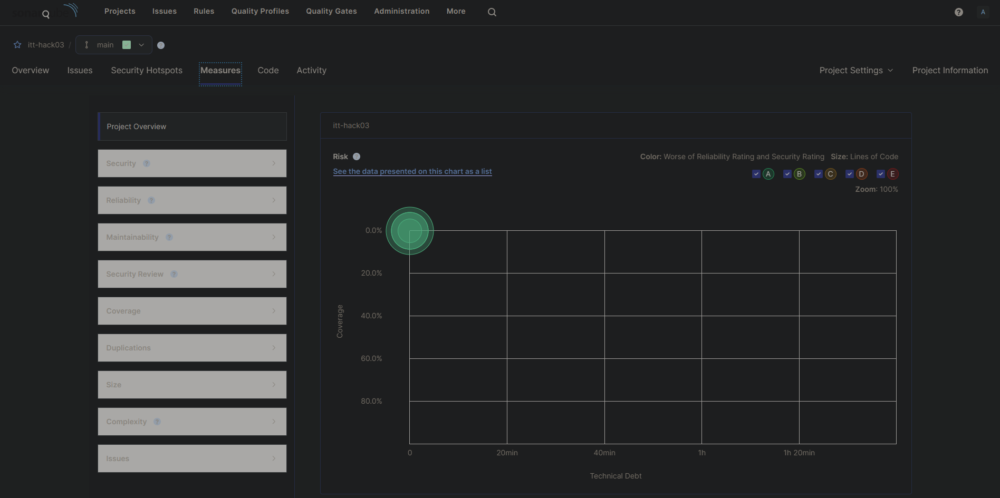
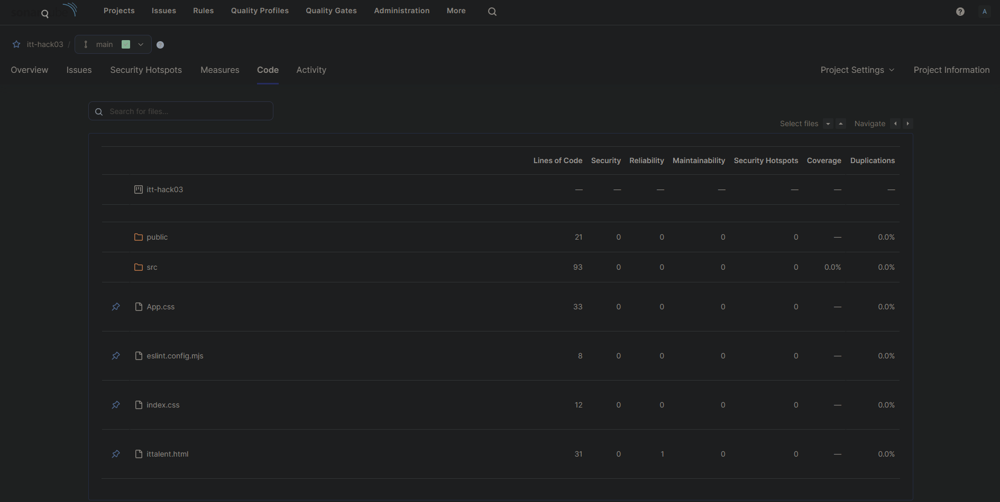
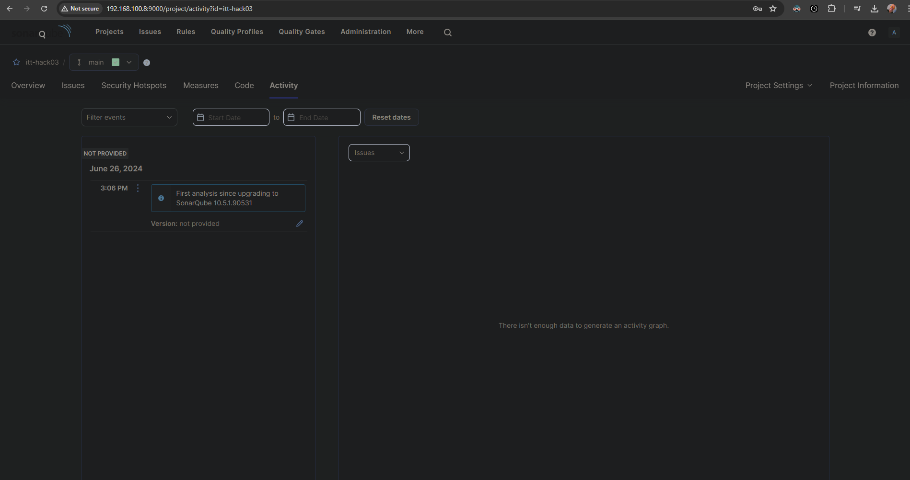
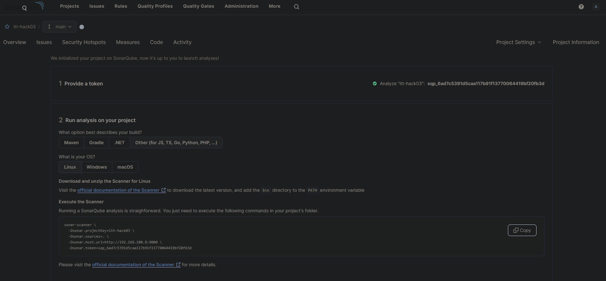
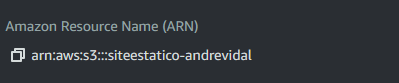
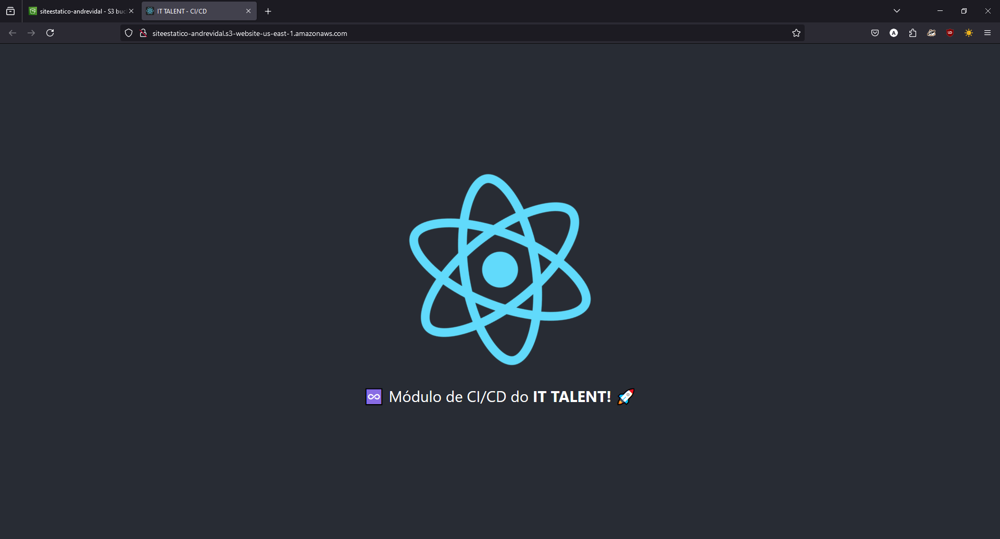

# itt hackathon 03

 Andre Vidal 👨🏽‍🦲

### Atividade 1 (5,0 pontos)  
Entregáveis:  
- Prints dos resultados do escaneamento conforme pdf em anexo do Sonarqube

- Print do token gerado

### Atividade 2 (5,0 pontos)  
Entregáveis:  
- O arquivo de workflow do github actions no seu repositório github público

- Prints:
    - Print do ID do recurso do seu S3 no Console AWS
    - Print de acesso ao link público com o build sendo acessado

    
http://siteestatico-andrevidal.s3-website-us-east-1.amazonaws.com/

